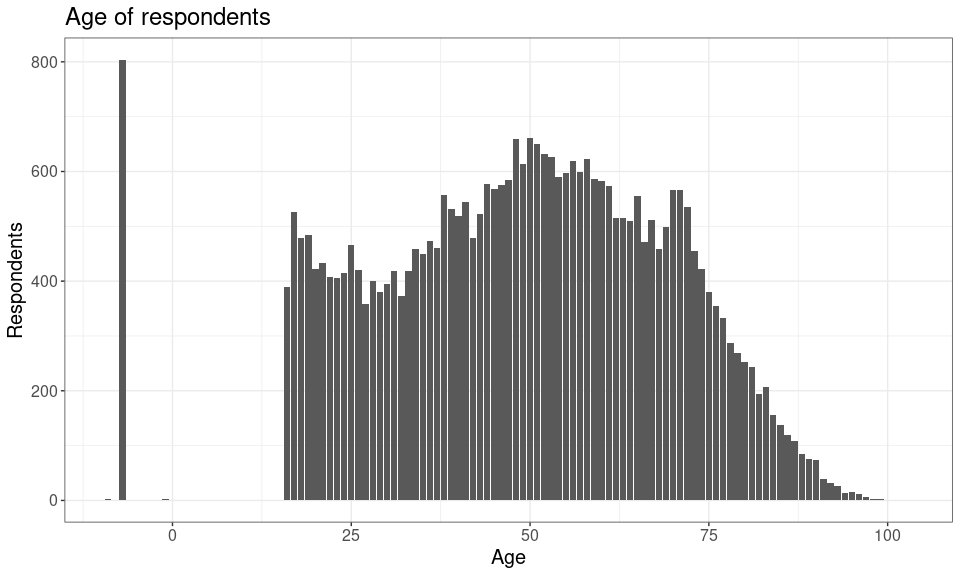

Transport variable explore
================
Mike Spencer
25/11/2021

``` r
library(tidyverse)
library(haven)
library(knitr)
```

``` r
theme_temp = function(){
  theme_bw() +
    theme(text = element_text(size = 15))
}
```

## Intro

This is an RMarkdown document, summarising variables of interest. I’m
considering the relationship between income and mode of travel. For
example, is cycling the preserve of the affluent middle class?

Understanding Society variable guide:
<https://www.understandingsociety.ac.uk/documentation/mainstage/dataset-documentation?search_api_views_fulltext=salary>.

``` r
df = read_dta("~/Cloud/personal/gofcoe/understanding_society/6614stata_B17CC6790677EF32F72CE50881AE98E1B9FC1F79133B07B63B353396D3AB917A_V1/UKDA-6614-stata/stata/stata13_se/ukhls_w10/j_indresp.dta")
```

## Age

``` r
df %>% 
  count(j_pdvage) %>% 
  ggplot(aes(j_pdvage, n)) +
  geom_col() +
  labs(title = "Age of respondents",
       x = "Age",
       y = "Respondents") +
  theme_temp()
```

<!-- -->

## Transport to work variables

### Main mode of transport to work

``` r
df %>% 
  count(j_wktrvfar)
```

    ## # A tibble: 15 x 2
    ##                                             j_wktrvfar     n
    ##                                              <dbl+lbl> <int>
    ##  1 -8 [inapplicable]                                   31914
    ##  2 -7 [proxy]                                            804
    ##  3 -2 [refusal]                                            7
    ##  4 -1 [don't know]                                        18
    ##  5  1 [Drive myself by car or van]                       434
    ##  6  2 [Get a lift with someone from household]           106
    ##  7  3 [ Get a lift with someone outside the household]    58
    ##  8  4 [Motorcycle/moped/scooter]                          14
    ##  9  5 [Taxi/minicab]                                      18
    ## 10  6 [Bus/coach]                                        205
    ## 11  7 [Train]                                            411
    ## 12  8 [Underground/Metro/Tram/Light railway]             173
    ## 13  9 [Cycle]                                             58
    ## 14 10 [Walk]                                              90
    ## 15 97 [Other]                                              8

### Mode(s) of transport for journey to work

Variables:

-   wktrv1 Drive myself by car or van
-   wktrv2 Get a lift with someone from household
-   wktrv3 Get a lift with someone outside the household
-   wktrv4 Motorcycle/moped/scooter
-   wktrv5 Taxi/minicab
-   wktrv6 Bus/coach
-   wktrv7 Train
-   wktrv8 Underground/Metro/Tram/Light railway
-   wktrv9 Cycle
-   wktrv10 Walk
-   wktrv97 Other

Response options:

-   Value = 0.0 Label = Not mentioned
-   Value = 1.0 Label = Yes mentioned
-   Value = -1.0 Label = don’t know
-   Value = -9.0 Label = missing
-   Value = -8.0 Label = inapplicable
-   Value = -7.0 Label = proxy
-   Value = -2.0 Label = refusal

Employed:

``` r
df %>% 
  select(pidp, contains("j_wktrv"), -j_wktrvfar) %>% 
  pivot_longer(cols = !pidp) %>% 
  count(name, value) %>% 
  pivot_wider(names_from = name, values_from = n)
```

    ## # A tibble: 6 x 12
    ##            value j_wktrv1 j_wktrv10 j_wktrv2 j_wktrv3 j_wktrv4 j_wktrv5 j_wktrv6
    ##        <dbl+lbl>    <int>     <int>    <int>    <int>    <int>    <int>    <int>
    ## 1 -8 [inapplica…    17995     17995    17995    17995    17995    17995    17995
    ## 2 -7 [proxy]          804       804      804      804      804      804      804
    ## 3 -2 [refusal]          5         5        5        5        5        5        5
    ## 4 -1 [don't kno…       10        10       10       10       10       10       10
    ## 5  0 [Not menti…     5389     13147    14674    15097    15389    15384    14130
    ## 6  1 [Yes menti…    10115      2357      830      407      115      120     1374
    ## # … with 4 more variables: j_wktrv7 <int>, j_wktrv8 <int>, j_wktrv9 <int>,
    ## #   j_wktrv97 <int>

Self employed:

``` r
df %>% 
  select(pidp, contains("j_jswktrv"), -j_jswktrvfar) %>% 
  pivot_longer(cols = !pidp) %>% 
  count(name, value) %>% 
  pivot_wider(names_from = name, values_from = n)
```

    ## # A tibble: 6 x 12
    ##         value j_jswktrv1 j_jswktrv10 j_jswktrv2 j_jswktrv3 j_jswktrv4 j_jswktrv5
    ##     <dbl+lbl>      <int>       <int>      <int>      <int>      <int>      <int>
    ## 1 -8 [inappl…      31852       31852      31852      31852      31852      31852
    ## 2 -7 [proxy]         804         804        804        804        804        804
    ## 3 -2 [refusa…          3           3          3          3          3          3
    ## 4 -1 [don't …          4           4          4          4          4          4
    ## 5  0 [Not me…        352        1499       1622       1627       1647       1637
    ## 6  1 [Yes me…       1303         156         33         28          8         18
    ## # … with 5 more variables: j_jswktrv6 <int>, j_jswktrv7 <int>,
    ## #   j_jswktrv8 <int>, j_jswktrv9 <int>, j_jswktrv97 <int>

Larissa Pople notes we can add together travel from employed and self
employed categories.

### How many people report multiple modes?

``` r
df %>% 
  select(pidp, contains("wktrv"), -j_wktrvfar, -j_jswktrvfar) %>% 
  pivot_longer(cols = !pidp) %>% 
  mutate(name = str_replace(name, "j_js", "j_")) %>% 
  filter(value == 1) %>% 
  count(pidp, name = "modes") %>% 
  count(modes, name = "respondents")
```

    ## # A tibble: 7 x 2
    ##   modes respondents
    ##   <int>       <int>
    ## 1     1       15444
    ## 2     2        1159
    ## 3     3         440
    ## 4     4          96
    ## 5     5          17
    ## 6     6           2
    ## 7     7           1

### Distance to work

``` r
df %>% 
  count(j_workdis)
```

    ## # A tibble: 133 x 2
    ##    j_workdis     n
    ##        <dbl> <int>
    ##  1        -8 16190
    ##  2        -7   804
    ##  3        -2    91
    ##  4        -1   777
    ##  5         0   611
    ##  6         1  1989
    ##  7         2  1622
    ##  8         3  1571
    ##  9         4  1013
    ## 10         5  1304
    ## # … with 123 more rows

``` r
df %>% 
  filter(j_workdis >= 0) %>% 
  ggplot(aes(j_workdis)) +
  geom_histogram() +
  scale_x_log10() +
  labs(title = "How far do respondents live from work?",
       x = "Distance (miles, log scale)",
       y = "Respondents")
```

<!-- -->

## Individual income net

``` r
df %>% 
  filter(! j_fimnnet_dv %in% c(-9, -8, -2, -1)) %>% 
  transmute(j_fimnnet_dv = as.numeric(j_fimnnet_dv)) %>%
  ggplot(aes(j_fimnnet_dv)) +
  geom_histogram() +
  scale_x_log10() +
  labs(title = "Total net personal income",
       x = "Income (£, log scale)",
       y = "Respondents") +
  theme_temp()
```

<!-- -->

## Benefits

### income support

``` r
df %>% 
  count(j_benbase1)
```

    ## # A tibble: 5 x 2
    ##           j_benbase1     n
    ##            <dbl+lbl> <int>
    ## 1 -7 [proxy]           804
    ## 2 -2 [refusal]         161
    ## 3 -1 [don't know]      219
    ## 4  0 [Not mentioned] 32457
    ## 5  1 [Mentioned]       677

### job seekers

``` r
df %>% 
  count(j_benbase2)
```

    ## # A tibble: 5 x 2
    ##           j_benbase2     n
    ##            <dbl+lbl> <int>
    ## 1 -7 [proxy]           804
    ## 2 -2 [refusal]         161
    ## 3 -1 [don't know]      219
    ## 4  0 [Not mentioned] 32885
    ## 5  1 [Mentioned]       249

### universal credit

``` r
df %>% 
  count(j_benbase4)
```

    ## # A tibble: 5 x 2
    ##           j_benbase4     n
    ##            <dbl+lbl> <int>
    ## 1 -7 [proxy]           804
    ## 2 -2 [refusal]         161
    ## 3 -1 [don't know]      219
    ## 4  0 [Not mentioned] 32377
    ## 5  1 [Mentioned]       757

### Multiple benefits

How many respondents claim one or multiple benefits, from income
support, jobs seekers or universal credit.

``` r
df %>% 
  select(pidp, j_benbase1, j_benbase2, j_benbase4) %>% 
  pivot_longer(!pidp) %>% 
  mutate(value = replace(value, value < 0, 0)) %>% 
  group_by(pidp) %>% 
  summarise(benefits = sum(value)) %>% 
  count(benefits)
```

    ## # A tibble: 4 x 2
    ##   benefits     n
    ##      <dbl> <int>
    ## 1        0 32668
    ## 2        1  1618
    ## 3        2    31
    ## 4        3     1
