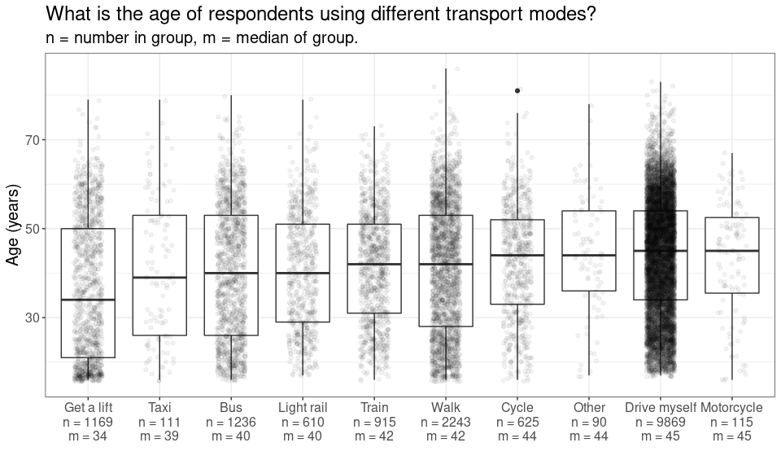
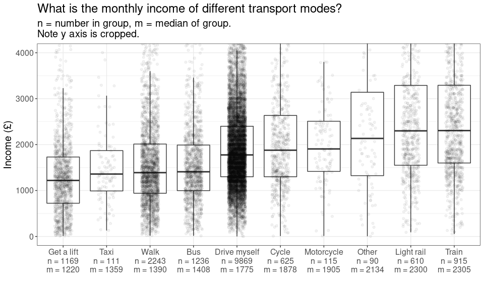

Transport variable explore
================
Mike Spencer
09/12/2021

``` r
library(tidyverse)
library(haven)
library(knitr)
```

``` r
theme_temp = function(){
  theme_bw() +
    theme(text = element_text(size = 15))
}
```

## Intro

This is an RMarkdown document, summarising variables of interest. I’m
considering the relationship between income and mode of travel. For
example, is cycling the preserve of the affluent middle class?

Understanding Society variable guide:
<https://www.understandingsociety.ac.uk/documentation/mainstage/dataset-documentation?search_api_views_fulltext=salary>.

## Data prep

Only employed people considered, i.e. self employed excluded. This is
due to the increase in data complexity of including both types.

Non-commuting journeys are not included in the Understanding Society
dataset.

``` r
df = read_dta("~/Cloud/personal/gofcoe/understanding_society/6614stata_B17CC6790677EF32F72CE50881AE98E1B9FC1F79133B07B63B353396D3AB917A_V1/UKDA-6614-stata/stata/stata13_se/ukhls_w10/j_indresp.dta") %>% 
  select(pidp, j_pdvage,
         contains("j_wktrv"), j_workdis,
         j_fimnnet_dv,
         j_benbase1, j_benbase2, j_benbase4)
```

``` r
tran_opt = tibble(name = paste0("j_wktrv", c(1:10, 97)),
       val = c("Drive myself", "Get a lift", "Get a lift", "Motorcycle",
               "Taxi", "Bus", "Train", "Light rail",
               "Cycle", "Walk", "Other"))
```

``` r
df = df %>% 
  filter(! j_fimnnet_dv %in% c(-9, -8, -2, -1)) %>% 
  mutate(j_fimnnet_dv = as.numeric(j_fimnnet_dv))
```

``` r
df = df %>% 
  filter(j_workdis >= 0)
```

``` r
x = df %>% 
  select(pidp, j_benbase1, j_benbase2, j_benbase4) %>% 
  pivot_longer(!pidp) %>% 
  mutate(value = replace(value, value < 0, 0)) %>% 
  group_by(pidp) %>% 
  summarise(benefits = sum(value))

df = df %>% 
  left_join(x)
```

## Results

### Age and mode of transport

``` r
x = df %>% 
  select(contains("j_wktrv"), j_pdvage) %>% 
  pivot_longer(!j_pdvage) %>% 
  filter(value == 1) %>% 
  left_join(tran_opt)

y = x %>% 
  group_by(val) %>% 
  summarise(median_in = median(j_pdvage),
            n = n()) %>% 
  mutate(lab = paste0(val, "\nn = ", n, "\nm = ", round(median_in)))

x %>% 
  filter(!is.na(val)) %>% 
  left_join(y) %>% 
  mutate(lab = fct_reorder(lab, median_in)) %>% 
  ggplot(aes(lab, j_pdvage)) +
  geom_boxplot() +
  labs(title = "What is the age of respondents using different transport modes?",
       subtitle = "n = number in group, m = median of group.",
       x = "",
       y = "Age (years)") +
  theme_temp()
```

<!-- -->

### Replaceable journeys

``` r
x = df %>% 
  filter(j_wktrv1 == 1)

x %>% 
  ggplot(aes(j_workdis)) +
  stat_ecdf() +
  geom_vline(xintercept = 1.5, linetype = "dotted") +
  geom_vline(xintercept = 5, linetype = "dashed") +
  geom_vline(xintercept = 10, linetype = "dotdash") +
  coord_cartesian(xlim = c(0, 30)) +
  scale_y_continuous(labels = scales::percent) +
  labs(title = "How many car commutes could be active travel?",
       subtitle = "Vertical lines of: walking, cycling, e-cycling.\nNote x axis is cropped.",
       x = "Distance to work (miles)",
       y = "Percent of respondents") +
  theme_temp()
```

<!-- -->

-   640 of 9871 (6 %) of respondents drive to work is 1 mile :-(
-   769 of 9871 (8 %) of respondents drive to work is less than walking
    distance (1.5 miles)
-   3189 of 9871 (32 %) of respondents drive to work is less than
    cycling distance (5 miles) 5762 of 9871 (58 %) of respondents drive
    to work is less than electric cycling distance (10 miles)

### Income and mode of transport

``` r
x = df %>% 
  select(contains("j_wktrv"), j_fimnnet_dv) %>% 
  pivot_longer(!j_fimnnet_dv) %>% 
  filter(value == 1) %>% 
  left_join(tran_opt)

y = x %>% 
  group_by(val) %>% 
  summarise(median_in = median(j_fimnnet_dv),
            n = n()) %>% 
  mutate(lab = paste0(val, "\nn = ", n, "\nm = ", round(median_in)))

x %>% 
  filter(!is.na(val)) %>% 
  left_join(y) %>% 
  mutate(lab = fct_reorder(lab, median_in)) %>% 
  ggplot(aes(lab, j_fimnnet_dv)) +
  geom_boxplot() +
  coord_cartesian(ylim = c(0, 4000)) +
  labs(title = "What is the monthly income of different transport modes?",
       subtitle = "n = number in group, m = median of group.\nNote y axis is cropped.",
       x = "",
       y = "Income (£)") +
  theme_temp()
```

<!-- -->
