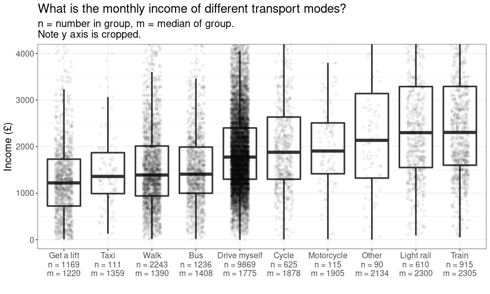

Transport variable explore
================
Mike Spencer
09/12/2021

``` r
library(tidyverse)
library(haven)
library(knitr)
```

``` r
theme_temp = function(){
  theme_bw() +
    theme(text = element_text(size = 15))
}
```

## Intro

This is an RMarkdown document, summarising variables of interest. I’m
considering the relationship between income and mode of travel. For
example, is cycling the preserve of the affluent middle class?

Understanding Society variable guide:
<https://www.understandingsociety.ac.uk/documentation/mainstage/dataset-documentation?search_api_views_fulltext=salary>.

## Data prep

``` r
df = read_dta("~/Cloud/personal/gofcoe/understanding_society/6614stata_B17CC6790677EF32F72CE50881AE98E1B9FC1F79133B07B63B353396D3AB917A_V1/UKDA-6614-stata/stata/stata13_se/ukhls_w10/j_indresp.dta") %>% 
  select(pidp, j_pdvage,
         contains("wktrv"), j_workdis,
         j_fimnnet_dv,
         j_benbase1, j_benbase2, j_benbase4)
```

``` r
tran_opt = tibble(name = paste0("j_wktrv", c(1:10, 97)),
       val = c("Drive myself", "Get a lift", "Get a lift", "Motorcycle",
               "Taxi", "Bus", "Train", "Light rail",
               "Cycle", "Walk", "Other"))

df %>% 
  select(pidp, contains("wktrv"), -j_wktrvfar, -j_jswktrvfar) %>% 
  pivot_longer(cols = !pidp) %>% 
  mutate(name = str_remove(name, "j_js"),
         name = str_remove(name, "j_")) %>% 
  left_join(tran_opt) %>% 
  filter(value == 1) %>% 
  mutate(did_they = "Yes") %>% 
  select(-name, -value) %>% 
  pivot_wider(id_cols = pidp, names_from = val, values_from = did_they)
```

``` r
df = df %>% 
  filter(! j_fimnnet_dv %in% c(-9, -8, -2, -1)) %>% 
  mutate(j_fimnnet_dv = as.numeric(j_fimnnet_dv))
```

``` r
df = df %>% 
  filter(j_workdis >= 0)
```

``` r
df %>% 
  select(pidp, j_benbase1, j_benbase2, j_benbase4) %>% 
  pivot_longer(!pidp) %>% 
  mutate(value = replace(value, value < 0, 0)) %>% 
  group_by(pidp) %>% 
  summarise(benefits = sum(value)) %>% 
  count(benefits)
```

## Age

``` r
df %>% 
  count(j_pdvage) %>% 
  ggplot(aes(j_pdvage, n)) +
  geom_col() +
  labs(title = "Age of respondents",
       x = "Age",
       y = "Respondents") +
  theme_temp()
```

Employed:

``` r
df %>% 
  select(pidp, contains("j_wktrv"), -j_wktrvfar) %>% 
  pivot_longer(cols = !pidp) %>% 
  count(name, value) %>% 
  pivot_wider(names_from = name, values_from = n)
```

Self employed:

``` r
df %>% 
  select(pidp, contains("j_jswktrv"), -j_jswktrvfar) %>% 
  pivot_longer(cols = !pidp) %>% 
  count(name, value) %>% 
  pivot_wider(names_from = name, values_from = n)
```

Larissa Pople notes we can add together travel from employed and self
employed categories.

### How many people report multiple modes?

``` r
df %>% 
  select(pidp, contains("wktrv"), -j_wktrvfar, -j_jswktrvfar) %>% 
  pivot_longer(cols = !pidp) %>% 
  mutate(name = str_replace(name, "j_js", "j_")) %>% 
  filter(value == 1) %>% 
  count(pidp, name = "modes") %>% 
  count(modes, name = "respondents")
```

## Results

``` r
x = df %>% 
  filter(j_wktrv1 == 1)

x %>% 
  ggplot(aes(j_workdis)) +
  stat_ecdf() +
  geom_vline(xintercept = 1.5, linetype = "dotted") +
  geom_vline(xintercept = 5, linetype = "dashed") +
  scale_x_continuous(limits = c(0, 80)) +
  scale_y_continuous(labels = scales::percent) +
  labs(title = "How many car commutes could be walked or cycled?",
       x = "Distance to work",
       y = "Percent of respondents") +
  theme_temp()
```

<!-- -->

640 of 9871 (6 %) of respondents drive to work is 1 mile :-(

``` r
tran_opt = tibble(name = paste0("j_wktrv", c(1:10, 97)),
       val = c("Drive myself", "Get a lift", "Get a lift", "Motorcycle",
               "Taxi", "Bus", "Train", "Light rail",
               "Cycle", "Walk", "Other"))

x = df %>% 
  select(contains("j_wktrv"), j_fimnnet_dv) %>% 
  pivot_longer(!j_fimnnet_dv) %>% 
  filter(value == 1) %>% 
  left_join(tran_opt)

y = x %>% 
  group_by(val) %>% 
  summarise(median_in = median(j_fimnnet_dv))

x %>% 
  left_join(y) %>% 
  mutate(val = fct_reorder(val, median_in)) %>% 
  ggplot(aes(val, j_fimnnet_dv)) +
  geom_boxplot() +
  scale_y_log10() +
  labs(title = "What is the monthly income of different transport modes?",
       x = "",
       y = "Income (£, log scale)") +
  theme_temp()
```

<!-- -->
