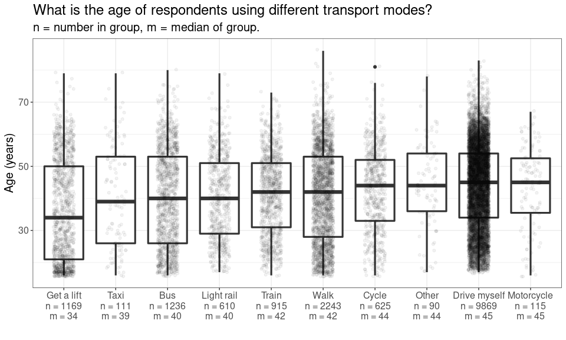

Transport mode analysis
================
Mike Spencer
09/12/2021

``` r
library(tidyverse)
library(haven)
library(knitr)
```

``` r
theme_temp = function(){
  theme_bw() +
    theme(text = element_text(size = 15))
}
```

## Intro

This is an RMarkdown document, presenting and discussing analysis of
transport mode data. I’m considering the relationship between income and
mode of travel. For example, is cycling the preserve of the affluent
middle class?

Understanding Society variable guide:
<https://www.understandingsociety.ac.uk/documentation/mainstage/dataset-documentation?search_api_views_fulltext=salary>.

## Data prep

Only employed people considered, i.e. self employed excluded. This is
due to the increase in data complexity of including both types.

Non-commuting journeys are not available in the Understanding Society
dataset.

``` r
df = read_dta("~/Cloud/personal/gofcoe/understanding_society/6614stata_B17CC6790677EF32F72CE50881AE98E1B9FC1F79133B07B63B353396D3AB917A_V1/UKDA-6614-stata/stata/stata13_se/ukhls_w10/j_indresp.dta") %>% 
  select(pidp, j_pdvage, j_sex,
         contains("j_wktrv"), j_workdis,
         j_fimnnet_dv,
         j_benbase1, j_benbase2, j_benbase4) %>% 
  mutate(j_sex = as_factor(j_sex))
```

``` r
tran_opt = tibble(name = paste0("j_wktrv", c(1:10, 97)),
       val = c("Drive myself", "Get a lift", "Get a lift", "Motorcycle",
               "Taxi", "Bus", "Train", "Light rail",
               "Cycle", "Walk", "Other"))
```

``` r
df = df %>% 
  filter(! j_fimnnet_dv %in% c(-9, -8, -2, -1)) %>% 
  mutate(j_fimnnet_dv = as.numeric(j_fimnnet_dv))
```

``` r
df = df %>% 
  filter(j_workdis >= 0)
```

``` r
x = df %>% 
  select(pidp, j_benbase1, j_benbase2, j_benbase4) %>% 
  pivot_longer(!pidp) %>% 
  mutate(value = replace(value, value < 0, 0)) %>% 
  group_by(pidp) %>% 
  summarise(benefits = sum(value))

df = df %>% 
  left_join(x)
```

``` r
df_long = df %>% 
  filter(j_pdvage > 0) %>% 
  select(contains("j_wktrv"), j_pdvage, j_sex, j_fimnnet_dv, j_workdis) %>% 
  pivot_longer(contains("j_wktrv")) %>% 
  filter(value == 1) %>% 
  left_join(tran_opt) %>% 
  filter(!is.na(val))
```

## Results

### Group sizes

``` r
df_long %>% 
  count(val, j_sex) %>% 
  pivot_wider(names_from = j_sex, values_from = n) %>% 
  kable()
```

| val          | male | female |
|:-------------|-----:|-------:|
| Bus          |  457 |    779 |
| Cycle        |  413 |    212 |
| Drive myself | 4480 |   5389 |
| Get a lift   |  408 |    761 |
| Light rail   |  318 |    292 |
| Motorcycle   |   97 |     18 |
| Other        |   54 |     36 |
| Taxi         |   26 |     85 |
| Train        |  486 |    429 |
| Walk         |  830 |   1413 |

``` r
df_long %>% 
  count(val, j_sex) %>% 
  ggplot(aes(val, n, fill = j_sex)) +
  geom_col(position = "fill") +
  scale_y_continuous(labels = scales::percent) +
  labs(title = "What is the proportion of each sex by transport type?",
       x = "",
       y = "Respondents",
       fill = "") +
  theme_temp() +
  theme(legend.position="bottom")
```

<!-- -->

### Age and mode of transport

``` r
y = df_long %>% 
  group_by(val) %>% 
  summarise(median_in = median(j_pdvage),
            n = n()) %>% 
  mutate(lab = paste0(val, "\nn = ", n, "\nm = ", round(median_in)))

df_long %>% 
  left_join(y) %>% 
  mutate(lab = fct_reorder(lab, median_in)) %>% 
  ggplot(aes(lab, j_pdvage)) +
  geom_boxplot() +
  geom_jitter(width = 0.2, alpha = 0.05) +
  labs(title = "What is the age of respondents using different transport modes?",
       subtitle = "n = number in group, m = median of group.",
       x = "",
       y = "Age (years)") +
  theme_temp()
```

<!-- -->

-   Younger people are more likely to get a lift to work. Getting a lift
    is an inherently dependent activity, which is asociated with being
    young.
-   Motorbike commuting may increase in midlife ;-)

### Age, sex and mode of transport

``` r
y = df_long %>% 
  group_by(val) %>% 
  summarise(median_in = median(j_pdvage),
            n = n()) %>% 
  mutate(lab = paste0(val, "\nn = ", n, "\nm = ", round(median_in)))

df_long %>% 
  left_join(y) %>% 
  mutate(lab = fct_reorder(lab, median_in)) %>% 
  ggplot(aes(lab, j_pdvage, colour = j_sex)) +
  geom_boxplot() +
  geom_jitter(width = 0.2, alpha = 0.05) +
  labs(title = "What is the age of respondents using different transport modes?",
       subtitle = "n = number in group, m = median of group.",
       x = "",
       y = "Age (years)",
       colour = "") +
  theme_temp() +
  theme(legend.position="bottom")
```

<!-- -->

### Replaceable journeys

``` r
x = df %>% 
  filter(j_wktrv1 == 1)

x %>% 
  ggplot(aes(j_workdis, colour = j_sex)) +
  stat_ecdf(size = 1.2) +
  geom_vline(xintercept = 1.5, linetype = "dotted") +
  geom_vline(xintercept = 5, linetype = "dashed") +
  geom_vline(xintercept = 10, linetype = "dotdash") +
  coord_cartesian(xlim = c(0, 30)) +
  scale_y_continuous(labels = scales::percent) +
  labs(title = "How many car commutes could be active travel?",
       subtitle = "Vertical lines of: walking, cycling, e-cycling.\nNote x axis is cropped.",
       x = "Distance to work (miles)",
       y = "Percent of respondents",
       colour = "") +
  theme_temp() +
  theme(legend.position="bottom")
```

<!-- -->

-   640 of 9871 (6 %) of respondents drive to work is 1 mile :-(
-   769 of 9871 (8 %) of respondents drive to work is less than walking
    distance (1.5 miles)
-   3189 of 9871 (32 %) of respondents drive to work is less than
    cycling distance (5 miles)
-   5762 of 9871 (58 %) of respondents drive to work is less than
    electric cycling distance (10 miles)
-   More men travel further to work
-   What are the barriers to women undertaking short journeys
    sustainably? Is this linked to trip chaining, unsafe routes,
    something else?

### Income and mode of transport

``` r
y = df_long %>% 
  group_by(val) %>% 
  summarise(median_in = median(j_fimnnet_dv),
            n = n()) %>% 
  mutate(lab = paste0(val, "\nn = ", n, "\nm = ", round(median_in)))

df_long %>% 
  left_join(y) %>% 
  mutate(lab = fct_reorder(lab, median_in)) %>% 
  ggplot(aes(lab, j_fimnnet_dv)) +
  geom_boxplot(outlier.alpha = 0) +
  geom_jitter(width = 0.2, alpha = 0.05) +
  coord_cartesian(ylim = c(0, 4000)) +
  labs(title = "What is the monthly income of different transport modes?",
       subtitle = "n = number in group, m = median of group.\nNote y axis is cropped.",
       x = "",
       y = "Income (£)") +
  theme_temp()
```

<!-- -->

-   3 step changes:
    -   Get a lift is a dependent activity
    -   Driving/cycling/motor cycling more automous than bus/taxi travel
    -   Light rail and train access to more prestigious, city centre
        jobs.
-   This type of analysis may support transport poverty work - areas
    with less transport links reduce job options.

### Relationships

``` r
df_long %>% 
  filter(value == 1) %>% 
  ggplot(aes(j_pdvage, j_fimnnet_dv)) +
  geom_point(alpha = 0.15) +
  stat_smooth() +
  facet_wrap(~val) +
  scale_y_continuous(labels = scales::comma) +
  labs(title = "How does income relate to age?",
       x = "Age (years)",
       y = "Monthly income (£)") +
  theme_temp()
```

<!-- -->

``` r
df_long %>% 
  filter(value == 1) %>% 
  ggplot(aes(j_workdis, j_fimnnet_dv)) +
  geom_point(alpha = 0.15) +
  stat_smooth() +
  facet_wrap(~val) +
  scale_y_continuous(labels = scales::comma) +
  coord_cartesian(xlim = c(0, 100)) +
  labs(title = "How does distance to work relate to age?",
       subtitle = "Distance axis cropped. Some people may use multiple transport modes",
       x = "Distance (miles)",
       y = "Monthly income (£)") +
  theme_temp()
```

<!-- -->

-   On average, people seem to travel further for better paid work.
-   In practice, I think people are unwilling to travel further for less
    well paid work. i.e. income does seem to increase with greater
    distance, but lower incomes drop out.
